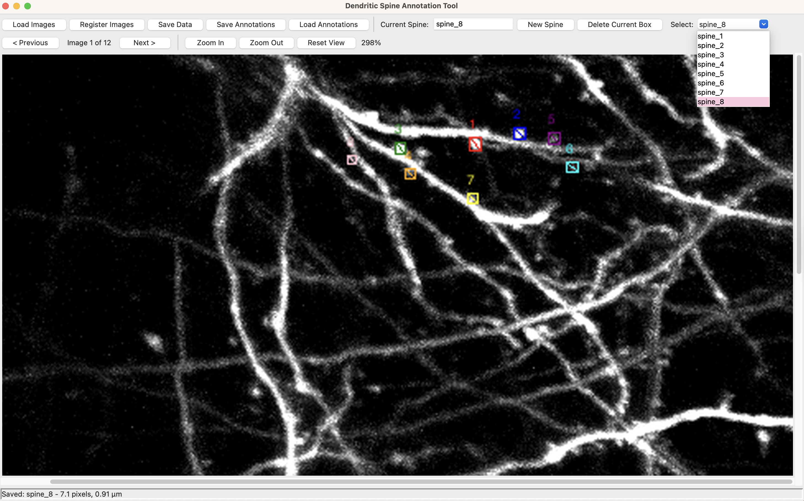

# Dendritic Spine Annotator Tool
This tool is a Python desktop application (VS Code) for analyzing dendritic spines across multiple microscopy images, allowing neuroscience researchers to efficiently annotate, count, and track dendritic spine lengths by drawing bounding boxes across a series of TIF images. The program automatically calculates diagonal measurements in both pixels and microns, tracks the same spine across multiple timepoints, and exports all data to CSV format for analysis. 

_UPDATE_: Added functionality to save annotations (in JSON format), load them on top of the images when starting a new session, and access/edit previous spines via dropdown selection.
<p align="center">
  
</p>

## Spine Motility Analysis
$$
(\text{motility})_s = \frac{1}{T} \sum_{t=0}^{T-\delta} \big[\text{length}(s, t + \delta) - \text{length}(s, t)\big]
$$

The program spine_motility.py takes in an input of spine length values and their respective labels/time points (i.e. what you get when you "Save Data" using the application) and outputs a measure of motility as outlined in the paper by [Djurisic et al](https://www.pnas.org/doi/10.1073/pnas.1321092110).
* s = spine index
* length(s,t) = length of s at spine t
* t	= time point variable (0, 5, 10, 15...)
* 𝑇 = total observation period (constant, e.g., 30 mins)
* δ	= time step between frames (5 min)

##  Step-by-Step Instructions for Setup
### Install Python
1. Download the latest [Python release](https://www.python.org/downloads/).
2. Follow the installation prompts.
3. Verify Python is installed by opening the **Mac Terminal** and running:
   ```bash
   python3 --version
   ```
### Set Up Visual Studio Code
1. [Download VS Code](https://code.visualstudio.com/) to your Downloads folder.  
2. Open the application.
3. Click the **Extensions** button in the left sidebar.
4. Search for **Python** and install the one published by **Microsoft**.
5. Open the **Command Palette** with:
   ```
   ⇧ Shift + ⌘ Command + P
   ```
6. Search for "Python: Select Interpreter"
7. Select the interpreter that matches the Python version you installed earlier.  

### Install Dependencies
In the **Mac Terminal**, install the required Python libraries:

```bash
pip install tifffile
pip install numpy
pip install pillow
pip install pandas
```
*(Other dependencies such as `tkinter`, `os`, and `math` should come pre-installed with Python.)*

### Run the Program
1. Quit and relaunch VS Code.  
2. Download the program file `label_dendritic_spines.py` from this repository.  
3. In VS Code, go to **File > Open** and open the `.py` file.  
4. Click the **Run** button (▶) in the top-right corner of VS Code.

## Application Usage
* Click **"Load Images"** and select a folder containing TIF files
* Enter a spine name (e.g., "spine_1") in the text field
* Draw a bounding box around the spine by clicking and dragging, **"Delete Current Box"** and redraw as needed
* Navigate to the next image 
* Continue annotating the same spine across all images
* Click **"New Spine"** to start annotating a different spine
* Select spine of interest in **spine dropdown** to edit/visit previous annotations

### Loading/Saving Data
* Click **"Save Data"** to export all measurements to CSV (logs spine name, length in pixels, microns, and stability)
* Click **"Save Annotations"** to export bounding boxes in JSON format, **"Load Annotations"** on the same image folder the next time you open the app

### Customizable Code
Change the following conversion factors/parameters for length and stability calculation:
```
def __init__(self):
   ...
   self.pixel_to_micron = 1/11  # conversion factor, based on confocal microscope settings
   self.stability_threshold = 50  # placeholder (pixel length for spine to be considered stable/unstable)
```
If not using .tif files (e.g. jpg or png):
```
def load_images(self):
   ...
   extensions = ('.tif', '.tiff') # your extensions here
```
*Note: for ome.tif files, more code is needed to extract metadata and compress by layer (can still use tifffile library by Python)*
